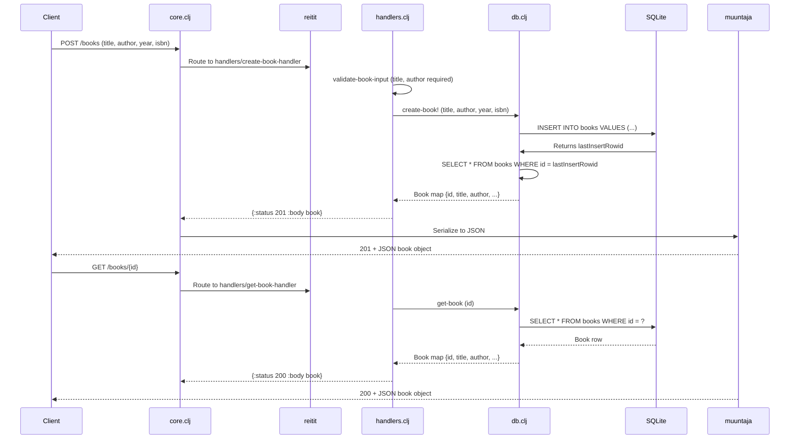

# Control Flow

## Happy-Path Request Flow: Create and Retrieve a Book

## Flow Narrative

A client calls `POST /books` with a JSON body containing title, author, year, and ISBN. The reitit router dispatches to `create-book-handler`, which calls `validate-book-input` to ensure title and author are non-empty. If validation passes, it invokes `db/create-book!`, which executes an INSERT statement and returns the newly created book row (including auto-generated ID). The handler responds with HTTP 201 and the book object. Muuntaja's middleware serializes the response body to JSON.

Subsequently, the client can retrieve the book via `GET /books/{id}`. The handler parses the ID from the path parameters, calls `db/get-book`, queries the database by ID, and returns HTTP 200 with the book object.

List operations (`GET /books`) follow a similar pattern, iterating over results. The optional `?author=` query parameter is passed to `db/list-books`, which uses a SQL LIKE filter if the author parameter is present.

## Known Issue: Response Serialization

The current implementation has a **response body serialization bug**: muuntaja middleware is configured but may not properly serialize Ring response maps to JSON. Tests expect the response body to be parsed as JSON (via `parse-body`), but the middleware may be returning the raw handler response map without JSON encoding. This causes test assertions to fail when extracting the book ID from POST responses.

## Update and Delete Flow

`PUT /books/:id` and `DELETE /books/:id` follow the same pattern:
1. Parse ID from path parameters
2. Verify book exists (404 if missing)
3. For PUT: validate input, execute update, return updated book
4. For DELETE: execute deletion, return 204 No Content

These operations fail in tests due to the cascading effect of POST body parsing — when the initial book creation doesn't return a usable ID, subsequent operations have nothing to operate on.
