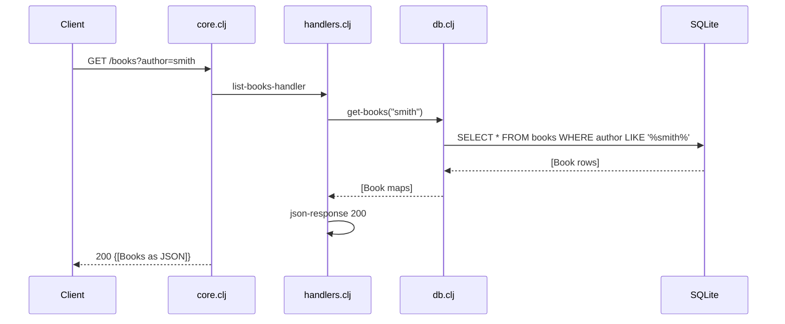

# Control Flow

## Request/Response Flow (Happy Path: List Books)

## Request Processing Pipeline

1. **Incoming Request** (core.clj, ring middleware)
   - Ring middleware (`wrap-json-body`, `wrap-params`) parses JSON body and query parameters
   - Request routed to appropriate handler based on method + path in `defroutes app-routes`

2. **Handler Processing** (handlers.clj)
   - Handler extracts parameters from request (body, query-params, path params)
   - Validates input if needed (POST/PUT require title and author)
   - Delegates database operations to db.clj functions
   - Formats response using `json-response` helper

3. **Database Layer** (db.clj)
   - Uses next.jdbc to execute SQL against SQLite
   - Manages datasource lifecycle (`get-ds`, `init-db!`)
   - Transactions wrap multi-step operations
   - Returns results as maps with lowercase unqualified keys

4. **Response** (core.clj)
   - Handler returns Ring response map: `{:status, :headers, :body}`
   - Ring/Jetty serializes to HTTP response

## Initialization Sequence

1. `-main` function (core.clj:25-29)
   - Calls `db/init-db!` to create `books` table if not exists
   - Reads PORT environment variable (default 3000)
   - Starts Jetty server with app and routes

2. Database Init (db.clj:14-22)
   - Creates datasource on first call to `get-ds`
   - Executes CREATE TABLE IF NOT EXISTS for `books`
