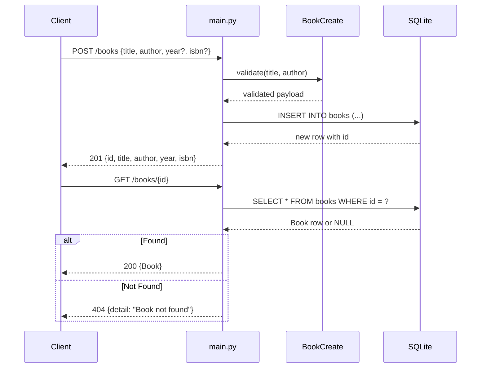

# Control Flow

## Happy Path: Create and Retrieve a Book

**Narration:** A client POST-ing a book triggers Pydantic validation of required fields (title, author must be non-empty). On success, the book is inserted into the SQLite `books` table and the new row (with auto-generated id) is returned as JSON with 201 Created. A subsequent GET request to `/books/{id}` opens a new database connection, queries by ID, and returns the row as JSON (200) or raises a 404 HTTPException if not found. All database connections are properly closed via `contextlib.closing()`.
