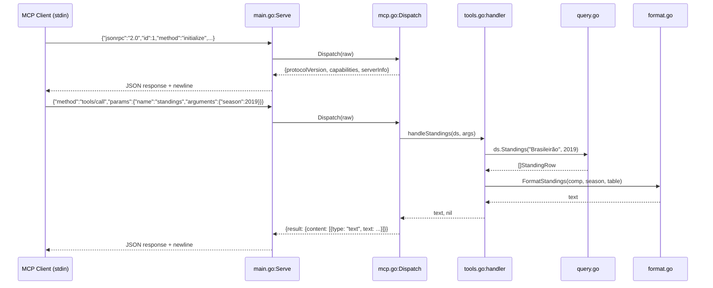

# Flow

On startup, `main()` resolves the data directory (CLI arg > env var > default), calls `LoadDataset()` which reads all 6 CSVs into a single in-memory `Dataset`, then enters the stdio `Serve` loop. Each line from stdin is unmarshaled as a JSON-RPC request and routed by `Dispatch` — protocol methods (initialize, ping, tools/list) are handled inline; `tools/call` looks up the named tool in the registry, invokes its handler with the dataset and arguments, and wraps the text result in an MCP content block. The response is marshaled and flushed to stdout. Notifications produce no output. The loop runs until EOF.

No concurrency, no caching, no middleware. All queries are full scans of in-memory slices. The standings query picks the single source with the most matches for a season to avoid double-counting across overlapping Brasileirão datasets.
