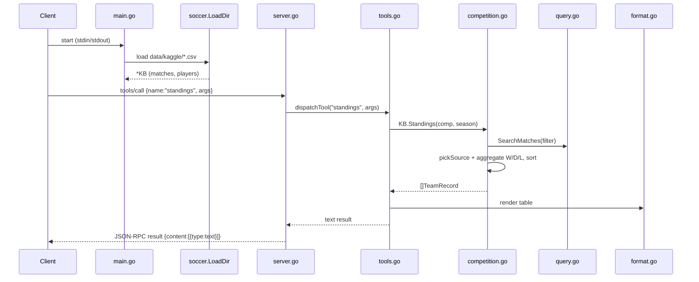

# Flow

At startup `main.go` calls `soccer.LoadDir` to ingest all five match CSVs and the FIFA player CSV into a single in-memory `KB`, then serves newline-delimited JSON-RPC over stdio. A `tools/call` request is decoded in `server.go`, routed by `dispatchTool` to the relevant `tool*` handler in `tools.go`, which converts MCP arguments into a `soccer` filter and calls the query engine. The `standings` path is representative: it filters matches, picks the single most-complete source per competition+season (`pickSource`) to avoid double-counting fixtures present in overlapping datasets, aggregates each team's record, and sorts by points → goal difference → goals for. Results are rendered to text by `format.go` and wrapped as MCP text content.

Notable, factual characteristics: team matching is accent- and suffix-insensitive (`NormalizeTeam`/`TeamsMatch`); overlapping datasets are explicitly deduplicated for standings/stats/biggest-wins via `DedupedMatches`/`pickSource`; CSV reading tolerates ragged rows, BOM, lazy quotes, and trailing `.0` on integers; dates are parsed across ISO and Brazilian `DD/MM/YYYY` layouts. There is no concurrency or external service access — all queries are synchronous over slices. Tool-level failures are returned as `isError` text rather than JSON-RPC errors, per MCP convention.
