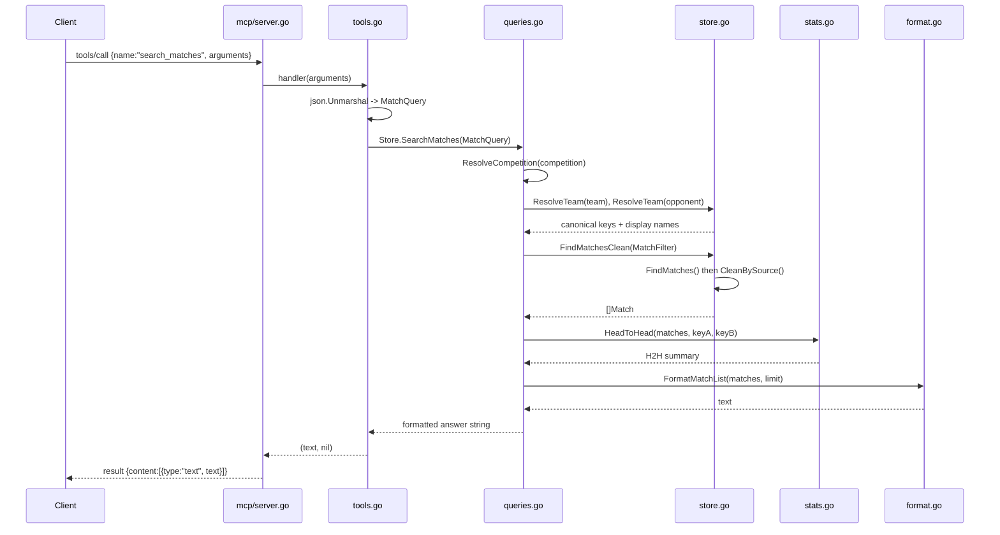

# Flow

The most representative flow is an MCP client calling the `search_matches` tool to find matches between two teams (the spec's headline "Flamengo vs Fluminense" example).

A `tools/call` request is parsed by the generic MCP server (`mcp/server.go`), which looks up the registered handler and invokes it inside a panic-recovering wrapper. The `search_matches` handler in `tools.go` unmarshals the arguments into a `soccer.MatchQuery` and calls `Store.SearchMatches`. That method resolves the fuzzy competition and team names to canonical keys (returning a disambiguation message if a name is ambiguous), builds a `MatchFilter`, and runs `FindMatchesClean` — a linear scan over all in-memory matches followed by `CleanBySource`, which drops cross-source double-counting by keeping, per (competition, season), only the single most complete source. The matches are formatted into a plain-text list; when both `team` and `opponent` are set, a head-to-head summary computed by `stats.go` is appended. The text is returned as a single MCP text content block.

Notable characteristics: all data is loaded into memory at startup (no database, no pagination — queries are linear scans). Team-name normalization is non-trivial (accent folding, state-suffix disambiguation, club aliases) and is the project's main complexity. Loaders are fault-tolerant (bad rows skipped, missing files logged not fatal). Tool execution errors and unresolved/ambiguous names are returned as informational text rather than protocol errors. No input validation beyond date parsing; competition/team names are resolved fuzzily rather than rejected.
