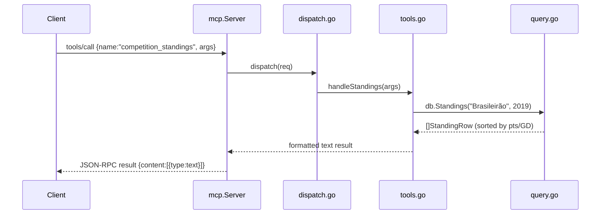

# Flow

An MCP client first sends `initialize` then `tools/list` to discover the 8
tools. A `tools/call` request is read by `mcp.Server.Serve`, JSON-decoded, and
routed through `dispatch` to the named handler in `tools.go`. The handler coerces
args (`args.go`), calls the pure query layer in `query.go` over the in-memory
`DB` loaded at startup from the six Kaggle CSVs, and formats the result as text
(`format.go`). Diagnostics go to stderr so stdout stays a clean JSON-RPC stream.

Notable: data is loaded once into memory at startup (no DB engine); CSV parsing
is deliberately lenient (bad cells skipped, not fatal); overlapping datasets are
deduped and a single authoritative source is chosen per (competition, season) to
avoid double-counting standings; team names are accent-folded and state-suffix
normalized so "Flamengo" / "Flamengo-RJ" resolve to one key.
