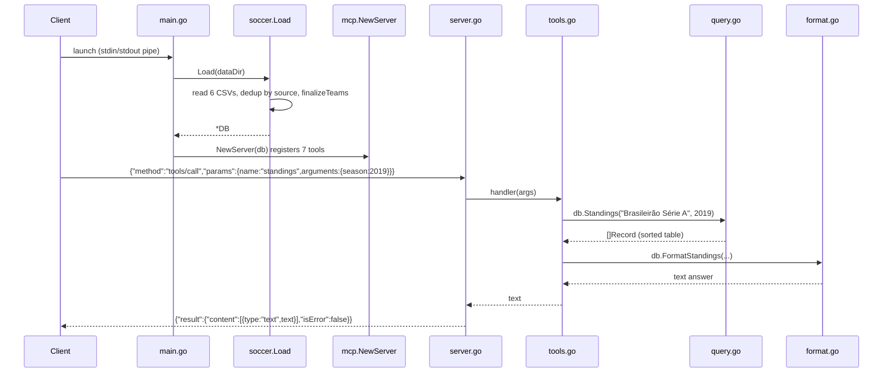

# Flow

At startup `main.go` loads the six bundled Kaggle CSVs into an in-memory
knowledge graph: each loader maps its file's columns onto the common `Match`
shape, `selectCoverage` keeps a single authoritative source per
(competition, season) to avoid cross-file duplication, and `finalizeTeams`
resolves team-name variants (state suffixes, accents, full names) into canonical
keys — disambiguating by region only when a base name is genuinely shared by
multiple major clubs. The server then serves MCP over stdio: each request line
is JSON-RPC-decoded, dispatched by method, and (for `tools/call`) routed to a
tool handler that parses loosely-typed LLM arguments, runs a pure query against
the graph, and formats the result as text. Tool-level errors are returned in the
MCP result envelope (`isError:true`) rather than as JSON-RPC errors, so the model
can read the message. No network access; the optional external APIs in the spec
are not used.
