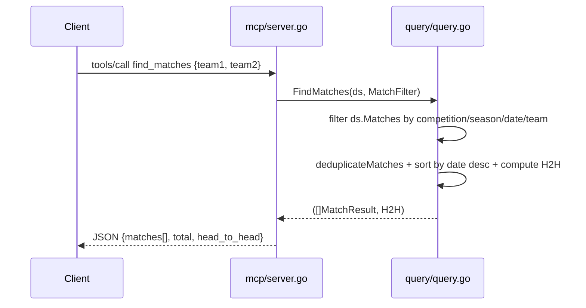

# Flow

A `tools/call` for `find_matches` is dispatched by `Server.Call`, which builds a `MatchFilter` and calls `query.FindMatches`. That iterates the pre-loaded in-memory `ds.Matches` (all CSVs loaded once at `NewServer`), applies competition/season/date/team filters using normalized team-name containment matching, deduplicates, sorts newest-first, and — when both `team1` and `team2` are set — computes a head-to-head W/D/L summary. The handler marshals the result to JSON wrapped in MCP `content`.

Notable: all data is loaded eagerly into memory at startup (no DB, no external API). Team matching is bidirectional substring containment on normalized names, which is lenient and can over-match short names. No pagination on match results (only player results honor `limit`). No external dependencies — pure Go stdlib.
