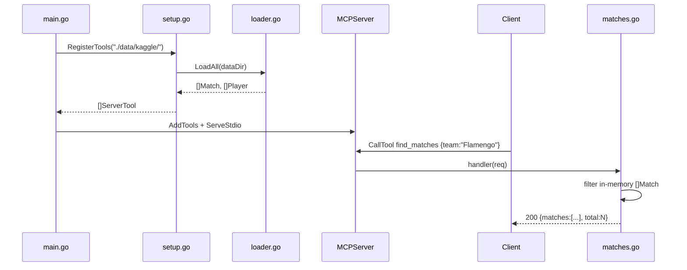

# Flow

At startup `main.go` calls `RegisterTools`, which eagerly loads all six CSVs into in-memory
`[]Match`/`[]Player` slices and returns six closures, each capturing the loaded data. The server
serves over stdio. A tool call (e.g. `find_matches`) runs a linear scan over the in-memory slice
applying the requested filters and returns a JSON text result. All queries are O(n) full scans over
the dataset — no indexing. Team matching is substring-based after stripping `-XX` state suffixes via
`NormalizeName`. Note: `find_matches` parses `season` only as a number; a season passed as a string
is silently ignored. There is no pagination on `find_matches` (only `find_players`/`get_statistics`
have a `limit`).
