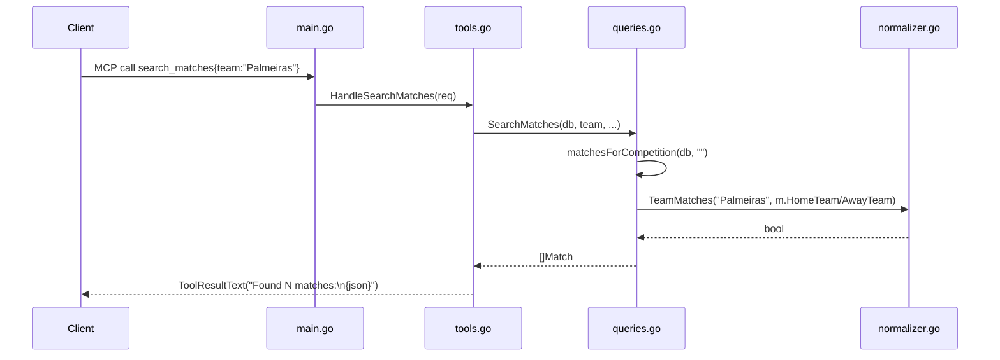

# Flow

At startup `main.go` loads all six CSV files into an in-memory `Database` (warnings logged, missing files non-fatal) and registers six MCP tools, then serves over stdio. A `search_matches` call flows to `HandleSearchMatches`, which parses parameters (dates via `ParseDate`), calls `SearchMatches`, which selects the competition pool (all if unset) and filters each match by team (`TeamMatches` normalizes `-XX` state suffixes and does case-insensitive substring matching), positional home/away, season, and date range, honoring `limit`. Results are marshaled to JSON and returned as tool text.

Notable characteristics (factual):
- Data is loaded fully into memory once; queries are linear scans across slices — fine for these dataset sizes, no indexing.
- CSV/date parse errors are swallowed (`ParseDate` returns a zero time with nil error; bad rows skipped/logged), so malformed data silently drops rather than erroring.
- `head_to_head`, `team_stats`, and `standings` aggregate over `matchesForCompetition`; standings are computed from match results (not hardcoded).
- Team-name accent differences are not normalized (e.g. "São Paulo" ≠ "Sao Paulo"), as asserted by `TestTeamMatches_NoFalsePositive`.
