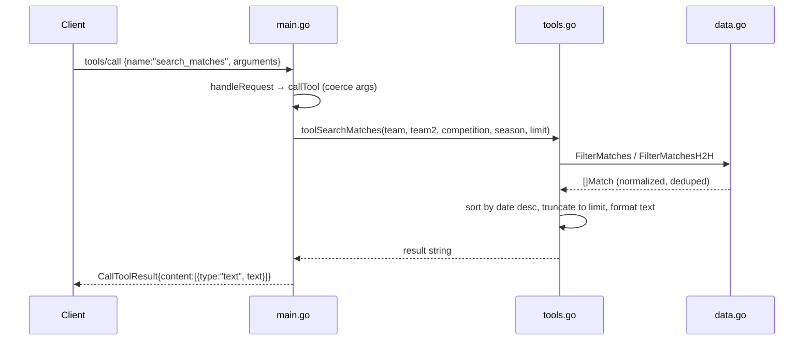

# Flow

A client sends a `tools/call` JSON-RPC line on stdin. `Server.Run` scans line-by-line, `handleRequest` routes `tools/call` to `callTool`, which coerces loosely-typed JSON args (helpers tolerate string/float/bool) and dispatches to the matching `tool*` function. The tool queries the in-memory `Database` (loaded once at startup from the CSVs), aggregates/sorts, and returns a human-readable text block wrapped in an MCP `CallToolResult`.

Notable characteristics (factual):
- Data is loaded fully into memory at startup; all queries are linear scans over slices — fine for these dataset sizes, no indexing.
- Tool outputs are pre-formatted text tables, not structured JSON payloads.
- Team matching is substring + accent/state-suffix normalization, bidirectional `Contains` in `teamMatches` (one-directional in `FilterMatches`).
- `search_matches` filters by team/competition/season but exposes no explicit date-range argument; date-range narrowing is only via `season`.
- `get_standings` with no competition aggregates across all competitions (knockout cups included).
