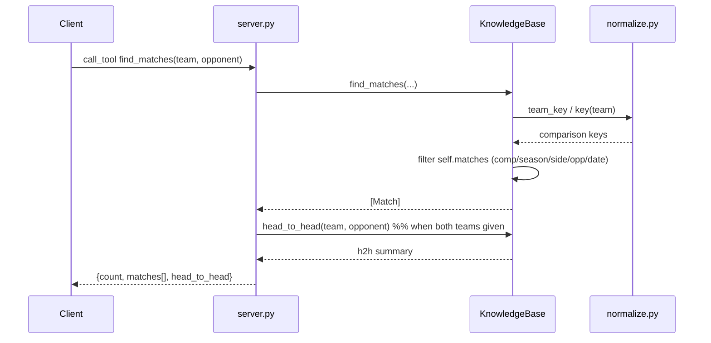

# Flow

A client invokes the `find_matches` MCP tool. `server.py` delegates to `KnowledgeBase.find_matches`, which normalizes the requested team/opponent names to accent- and case-insensitive keys (`normalize.py`), then linearly scans the pre-loaded in-memory match list applying competition, season, side (home/away/either), opponent and date-range filters, and sorts the survivors by date. When both `team` and `opponent` are supplied the tool also computes a head-to-head tally and attaches it. The dataset is loaded once at `create_server()` time from the CSVs under the data directory; overlapping source files are deduplicated to one primary source per (competition, season) before serving. Matching is substring/key based with no input validation beyond required-field checks; queries are O(n) over all matches per call.
