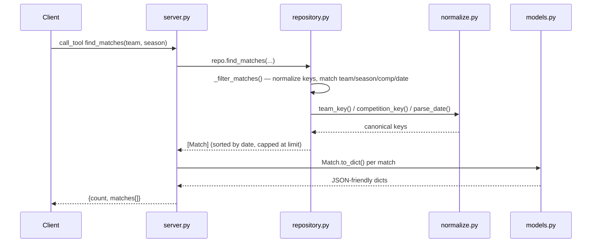

# Flow

A tool call enters through the FastMCP server (`server.py`), which is a thin
adapter: it forwards arguments to the matching `SoccerRepository` method. The
repository normalizes inputs (team names stripped of state suffixes/accents,
competitions canonicalized, dates parsed from multiple formats) via
`normalize.py`, filters the in-memory `Match`/`Player` lists, computes any
aggregates (records, standings, statistics), and returns plain values that
`models.py` serializes with `to_dict()`. Data is loaded once at
`create_server()` time by `data_loader.load_dataset()`, which dedups matches
that overlap across the source CSVs.

Deviations / notes:
- `find_matches` applies a default `limit=50` and reports `count` as the size of
  the *truncated* list, so a query with >50 results gives no signal that more
  exist.
- Standings dedup to a single dominant source file per season
  (`_dominant_source_only`) to avoid double-counting, but `statistics()` and
  `biggest_wins()` aggregate across all sources without that dedup.
- No network/API access at query time; all data is in memory. No input
  validation beyond tolerant parsing (malformed rows are dropped, not errored).
