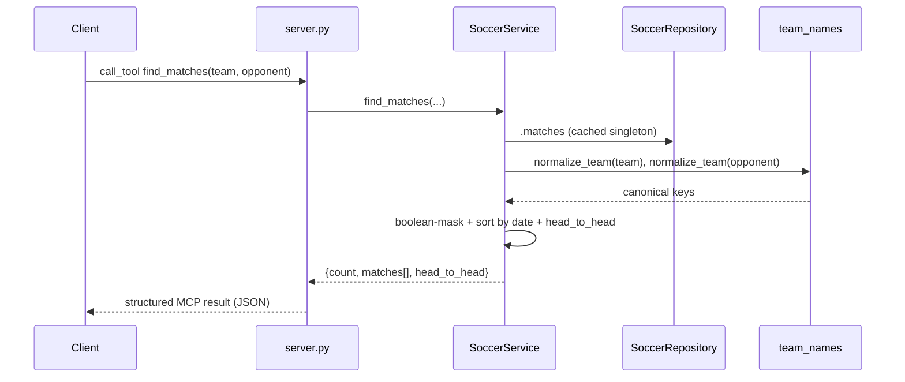

# Flow

A client calls the `find_matches` MCP tool; `server.py` forwards to `SoccerService.find_matches`, which reads the cached `SoccerRepository.matches` DataFrame, normalizes the team/opponent names to canonical keys via `team_names.normalize_team`, builds a boolean mask over `home_key`/`away_key` (plus optional competition/season/date filters), sorts newest-first, and — when both teams are given — computes a head-to-head summary. The dict is returned as a structured MCP tool result.

Notable: data is loaded once into a module-level singleton (`SoccerRepository.default()`), so the first tool call pays the CSV-parse cost. Aggregation loops (`get_team_record`, `_head_to_head`, `get_standings`) iterate rows with `DataFrame.iterrows()` rather than vectorized pandas operations. Overlapping Brasileirão sources are de-duplicated at load time by a fixed source-preference order so standings aren't double-counted.
