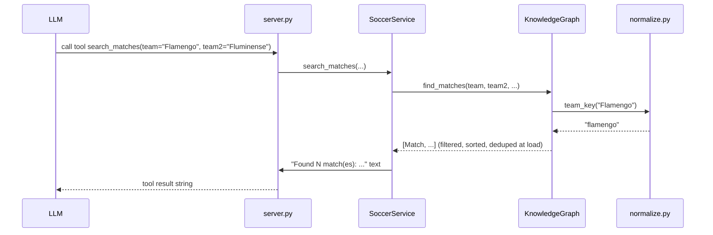

# Flow

A tool call enters through a FastMCP-registered wrapper in `server.py:build_server`, which forwards to the matching `SoccerService` method. The service delegates the actual filtering/aggregation to a `KnowledgeGraph` that was built once at startup from `data_loader.load_matches`/`load_players`. Team and competition matching is accent/case-insensitive via `normalize.team_key` and `canonical_competition`. Duplicate/near-duplicate fixtures from overlapping source files are collapsed once in `KnowledgeGraph._dedup` (preferring the played copy), so queries operate on a cleaned set. The service formats the structured result into human-readable text before returning it to the LLM.

Notable: data is loaded eagerly and held entirely in memory (no DB, no pagination of the underlying store — only a `limit` on formatted output); all queries are synchronous list comprehensions; standings/stats are computed on demand from match results rather than cached.
