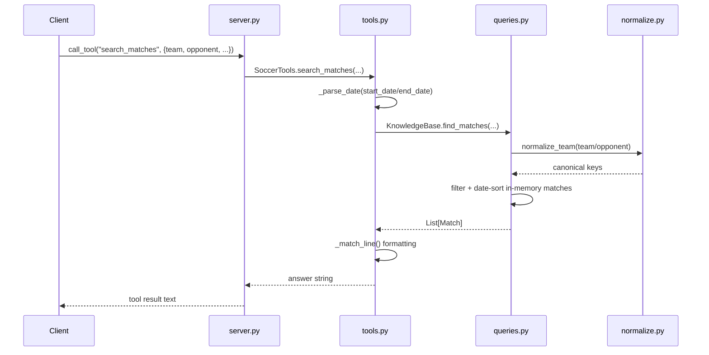

# Flow

A tool call enters the FastMCP server in `server.py`, which forwards to the matching `SoccerTools` method. The tool layer parses string dates and calls into `KnowledgeBase`, which normalizes team names to canonical keys (so "Palmeiras-SP" / "Sociedade Esportiva Palmeiras" collapse to one club), filters the in-memory match list by the supplied criteria, and date-sorts the result. The tool layer formats the records into a human-readable string and the server returns it.

Notable, factual points:
- All data is loaded into memory once (`KnowledgeBase.load`) and queried with plain Python loops — no database or external API.
- Parsing is deliberately tolerant: bad ints/dates become `None` rather than raising, so malformed CSV cells are dropped silently.
- Brasileirão seasons that overlap between two source files are de-duplicated by a first-source-wins owner map in `load_all_matches`.
- Standings apply official Brasileirão tiebreakers (points, wins, goal difference, goals for).
- Clean three-tier separation (server → format → query → data) keeps query and formatting logic unit-testable without standing up an MCP session.
