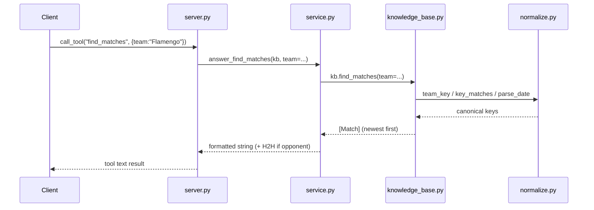

# Flow

A `find_matches` tool call routes through the FastMCP server to a `service.answer_*` formatter, which calls `SoccerKB.find_matches`. The KB iterates its in-memory match list, applying competition/season/date/venue filters via accent- and suffix-insensitive key matching from `normalize.py`, sorts newest-first, and returns `Match` objects; the service layer renders them as text. The KB is loaded once at server start from the CSV datasets (`SoccerKB.from_data_dir`), with cross-source de-duplication keeping one authoritative source per `(competition, season)`. Notable: the service/KB layers carry no MCP imports (so they unit-test directly); team-name normalization is centralized; standings, records, and stats are all computed from match results rather than stored.
