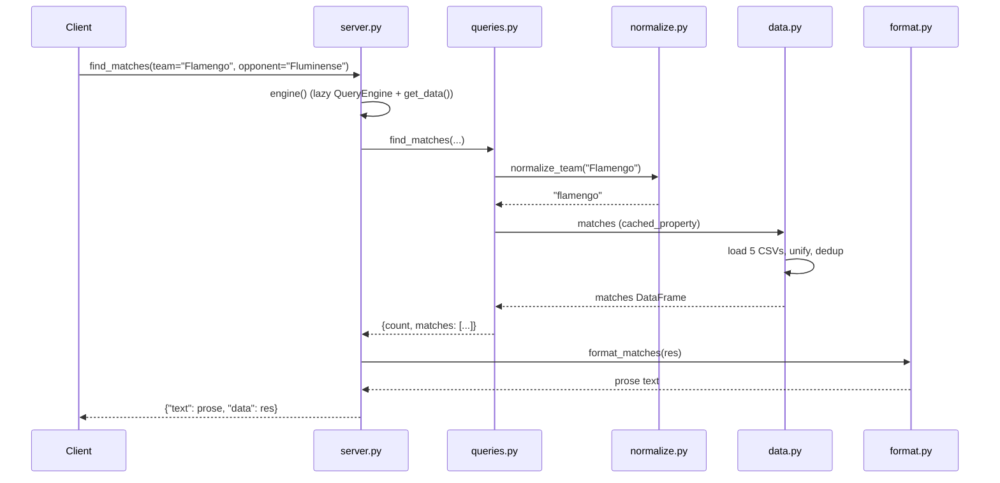

# Flow

On the first tool call, `server.engine()` lazily builds the `QueryEngine` and triggers `data.get_data()`, which reads all six Kaggle CSVs into a unified `matches` DataFrame (plus a deduplicated `matches_dedup` view and a FIFA `players` table). Team names from the request are passed through `normalize.normalize_team` (accent-folding, state/country-suffix stripping, alias mapping) so free-text spellings resolve to canonical keys before filtering. The query result is a JSON-serializable dict that `format.py` renders into prose; the tool returns both the prose (`text`) and the structured result (`data`). Data loading is deferred to first use, so server start-up is instant and a missing data directory surfaces as a tool error rather than an import-time crash. Standings, head-to-head, and aggregate stats run against the deduped view to avoid double-counting the overlapping Brasileirão files.
