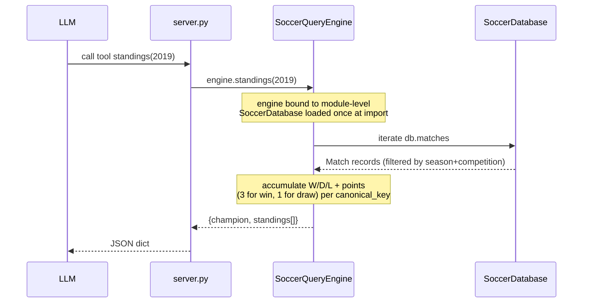

# Flow

A tool call (e.g. `standings(2019)`) is dispatched by FastMCP to the matching `@mcp.tool()` wrapper in `server.py`, which delegates to a single module-level `SoccerQueryEngine`. The engine's `SoccerDatabase` is loaded once at import time (all 6 CSVs parsed and normalized), so each call is an in-memory scan over `db.matches`/`db.players`. Standings are computed from match results rather than stored — teams are bucketed by `canonical_key()` (accent- and suffix-normalized) and ranked by points → goal difference → goals for. Team-name matching is fuzzy/accent-insensitive throughout, with explicit handling for ambiguous bases (Atlético-MG/PR/GO) and full-name aliases.

Notable: no HTTP layer (stdio MCP only); no async DB; all queries are linear scans over in-memory lists (acceptable for ~24k matches, validated by the `<2s`/`<5s` performance tests). No external API calls — purely the provided datasets.
