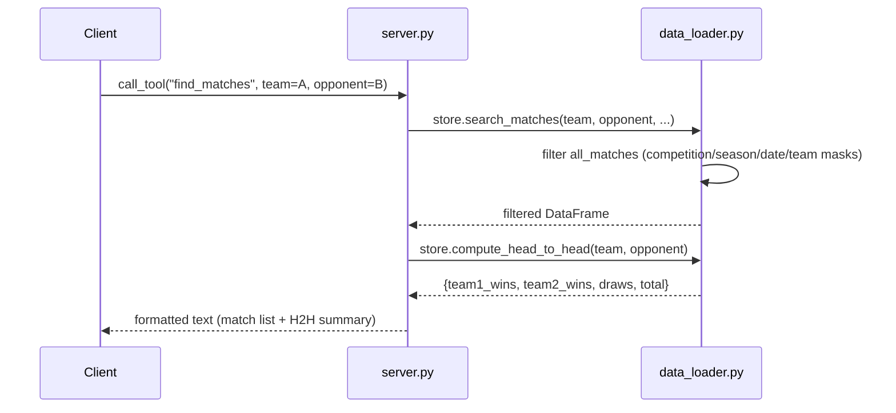

# Flow

A `find_matches` call routes into `DataStore.search_matches`, which copies the pre-built
`all_matches` frame and applies competition (alias-normalized), season, date-range, and
team/opponent substring masks against normalized team names, then sorts by date descending.
`server.py` renders the rows as text and, when both `team` and `opponent` are given, appends a
head-to-head summary.

Notable deviations from common patterns:
- All CSVs are loaded eagerly at import time (`store = DataStore(...)` at module top), so server
  startup pays the full parse cost; queries are then in-memory.
- Team matching is substring-based on normalized names — fast but can over-match (e.g. a short
  query is a substring of multiple clubs).
- `get_head_to_head`'s `season` argument filters only the displayed recent matches, not the
  W/D/L totals (see findings).
