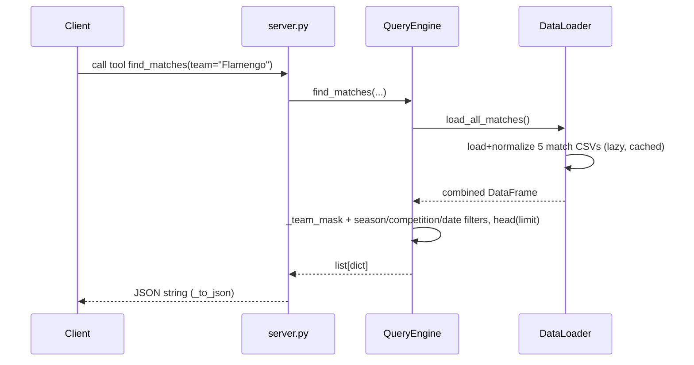

# Flow

A tool call enters `server.py`, which delegates to the singleton `QueryEngine`. On first use the `DataLoader` reads and normalizes the five match CSVs (team-name suffix stripping, multi-format date parsing, numeric coercion of goals) and concatenates them into one cached DataFrame; `find_players` similarly reads `fifa_data.csv`. The engine applies row-mask filters and returns records, which `server.py` serializes to JSON with a date-aware encoder. Aggregation methods (`get_team_stats`, `head_to_head`, `get_standings`) iterate the filtered frame with `DataFrame.iterrows()` rather than vectorized pandas; `get_standings` recomputes `get_team_stats` once per team, so it re-scans the matches per team. Goal columns are numeric-coerced (missing scores become `NaN`) but aggregation does not guard against `NaN` in the per-row win/loss/goal tallies.
