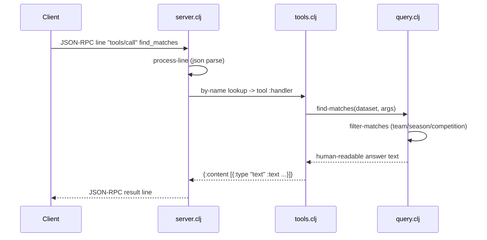

# Flow

A client sends a `tools/call` JSON-RPC line on stdin. `process-line` parses it and `handle-request` dispatches by method; for `tools/call` it looks the tool up in `tools/by-name`, invokes its `:handler` against the pre-loaded dataset (built once at `create-server` from `data/kaggle`), and wraps the returned answer string as MCP text content. Queries run over the in-memory normalized model, so no CSV is re-read per request. Tool-handler exceptions are caught and returned as JSON-RPC error `-32603`; unknown tools return `-32601`. The dataset is loaded eagerly at startup and held in memory — there is no pagination or streaming, and all filtering is linear scan over the normalized match/player vectors.
