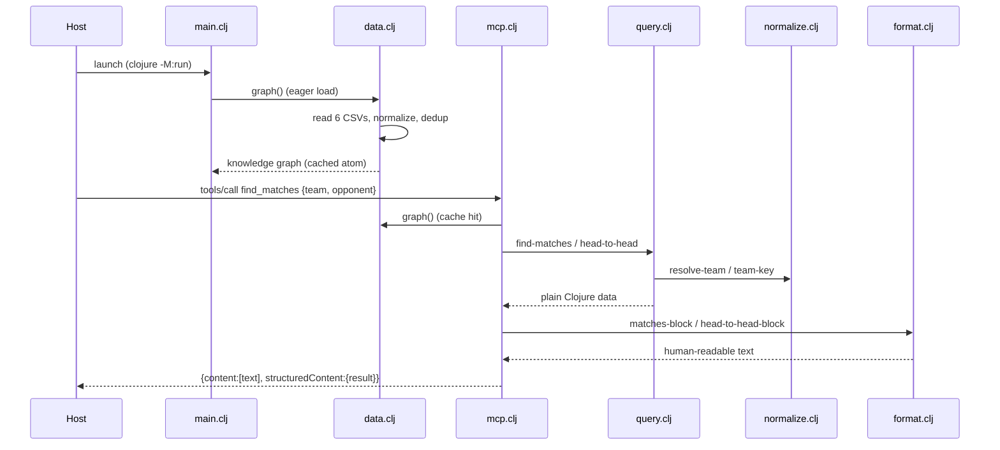

# Flow

A host process launches `main.clj`, which eagerly builds the in-memory knowledge graph from the six bundled CSVs (`data.clj:load-graph`, cached in an atom) and reports counts on stderr. It then runs `mcp.clj:serve!`, reading newline-delimited JSON-RPC from stdin. On a `tools/call` (e.g. `find_matches`), `handle-request` dispatches to the tool's handler, which resolves free-text team names to canonical keys via `normalize.clj`, runs the pure query in `query.clj`, formats the result through `format.clj`, and returns both the rendered text and the underlying structured data. Tool exceptions are caught and returned as `:isError true` rather than crashing the request loop.

Notable design points (factual):
- Query layer is pure (graph in, data out) and unit-tested without spawning a process; the protocol layer (`handle-request`) is likewise pure.
- Team-name resolution is accent/suffix/case-insensitive with an alias table and a substring fallback, addressing the spec's name-variation data-quality note.
- Overlapping Brasileirão sources are deduplicated on `[competition season home-key away-key]` (date deliberately excluded) to avoid double-counting the same fixture.
- Errors during tool calls surface as MCP `:isError` results; parse errors return JSON-RPC `-32700`.
