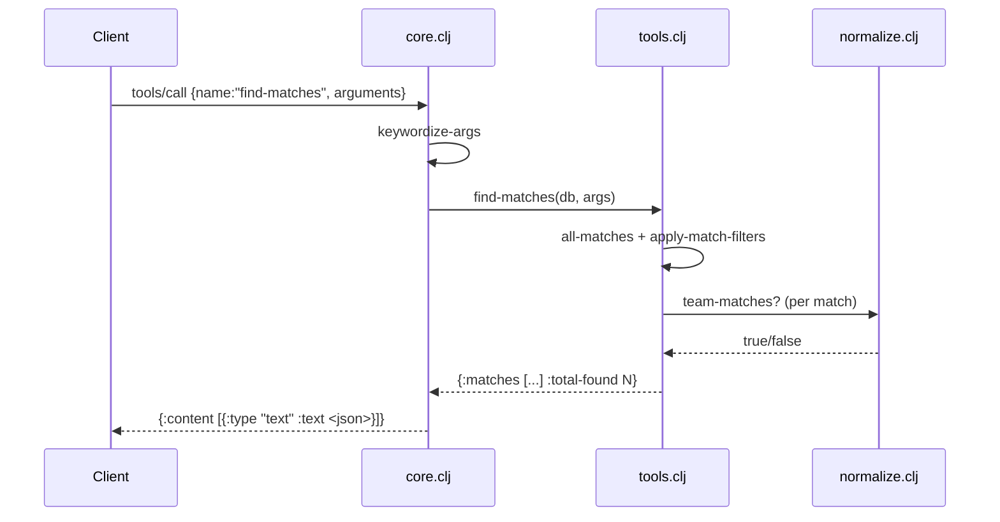

# Flow

A `tools/call` request for `find-matches` is parsed from a JSON line, its argument keys are underscore→hyphen keywordized, then `core/handle-call` dispatches to `tools/find-matches`. That concatenates all five match datasets (`all-matches`), applies the requested filters (team / competition / season / date range) using `normalize/team-matches?` for fuzzy team matching, sorts by date descending, and truncates to `limit`. The result map is JSON-serialized and wrapped in an MCP text-content response. Data is loaded once at startup by `data/load-all-data`; there is no pagination beyond `limit` and no persistence layer (all queries run over in-memory vectors).

Notable: the data is loaded eagerly at `-main` startup from `data/kaggle`; the acceptance tests bypass this JSON-RPC layer and call the `tools/*` functions directly against a shared preloaded dataset.
