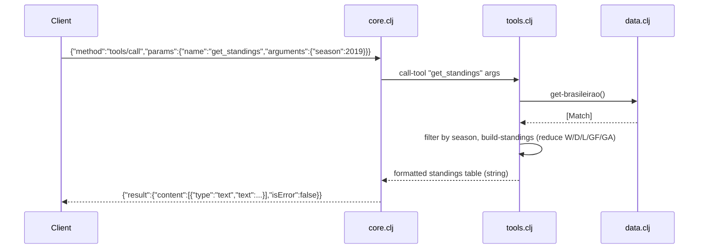

# Flow

A `tools/call` request is read line-by-line from stdin, parsed with cheshire, and routed by `handle-message`. `call-tool` dispatches on the tool name to one of the seven query fns. Data is served from an in-memory atom populated once at startup by `data/load-all-data!` (all six CSVs parsed eagerly). Each tool filters/aggregates the relevant collection and returns a preformatted text string, which the server wraps in an MCP `content` block and prints back as a JSON-RPC response.

Notable characteristics:
- **Eager full-dataset load at startup** — `load-all-data!` parses ~24k matches + 18k players into memory before serving; no lazy/indexed access, so every query is a linear scan.
- **Text-only tool output** — results are human-formatted strings rather than structured JSON, matching the spec's example answer format but limiting machine consumption.
- **`get_standings` season heuristic** — picks the `historico` dataset for pre-2012 seasons and `brasileirao` for 2012+, an undocumented internal split.
- **Standings use raw team names as keys** (no normalization) by deliberate choice, to avoid merging distinct clubs that share a base name (e.g. Atlético-MG vs Atlético-PR).
- Per-message error handling: a tool exception is caught and returned as `isError:true` rather than crashing the loop.
