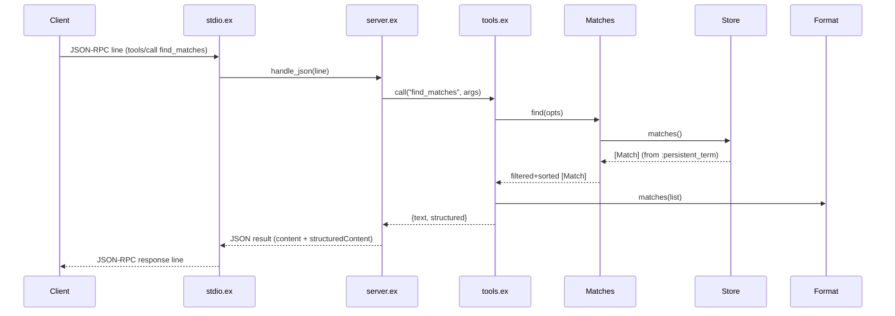

# Flow

A `tools/call` for `find_matches` arrives as a JSON line on stdin. `Server.handle_json/1` decodes it and dispatches to `Tools.call/2`, which converts the arguments into a keyword list and calls `Matches.find/1`. The query reads the de-duplicated match list from `Store` (published once into `:persistent_term` at startup), filters by the supplied criteria (team key, competition, season, date range), sorts most-recent-first, and caps the result. `Tools` renders both a human-readable text block (`Format.matches/1`) and a structured payload, which `Server` wraps as a JSON-RPC result. Errors are handled defensively: bad arguments yield `isError: true` tool results, unknown methods yield `-32601`, and handler crashes are rescued into a tool error rather than taking the server down. The data is loaded once at application start and never mutated, so query handlers are pure reads with no DB or network access on the hot path.
