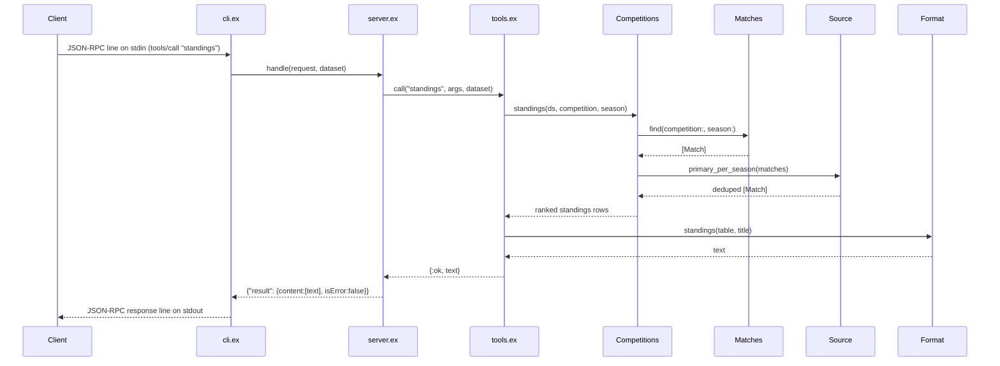

# Flow

A client sends a newline-delimited JSON-RPC request on stdin. `cli.ex` decodes
it and calls the pure `server.ex:handle/2`, which dispatches by method. For a
`tools/call`, `tools.ex` resolves the named tool, runs the matching
`Queries.*` function against the in-memory `Dataset`, and — for aggregate
queries — first reduces matches to one authoritative source per
`{competition, season}` via `Source.primary_per_season/1` to avoid double
counting across overlapping CSV files. The result is rendered to text by
`Format`, wrapped in MCP `content`, and written back as one JSON line on stdout.

Notable: the dataset is loaded once at startup and held in memory (no DB);
`server.ex:handle/2` is a pure function (transport isolated in `cli.ex`), which
makes the protocol layer directly unit-testable. Tool execution is wrapped in a
`rescue` so an exception becomes an `isError` MCP response rather than crashing
the server loop. Aggregation deliberately collapses overlapping sources while
match *search* spans all files.
