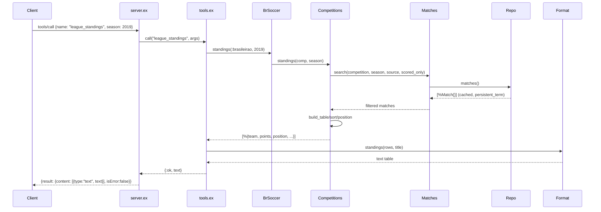

# Flow

A `tools/call` JSON-RPC request arrives over stdio. `server.ex:handle_message/1` (a pure string→map function) decodes it and routes to `Tools.call/2`, which finds the named tool, coerces/compacts its arguments, and invokes the matching `BrSoccer` facade function. The query modules read the once-parsed, `:persistent_term`-cached match/player lists from `Repo` and run plain in-memory `Enum` filters/reductions — for standings, a single preferred source per season is chosen to avoid double-counting, points are computed as 3·W+D, and the table is sorted and positioned. `Format` renders the result map to text, and `server.ex` wraps it in the MCP `content`/`isError` envelope. Tool handler exceptions are caught in `Tools.call/2` and returned as `isError: true` rather than crashing the loop. Notable: data is fully in-memory (no database/external API), the CSV parser and MCP transport are hand-rolled with no protocol libraries, and the protocol layer is decoupled from I/O so it is unit-testable.
