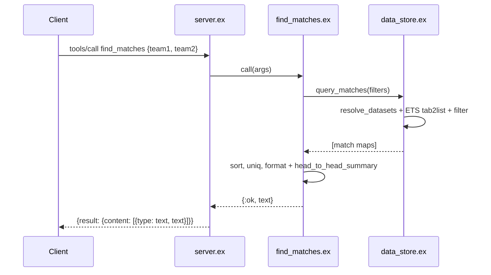

# Flow

A `tools/call` for `find_matches` is dispatched by `server.ex:handle_request/1` to `FindMatches.call/1`, which builds a filter map and calls `DataStore.query_matches/1`. The DataStore resolves which competition tables to scan, lists each ETS table, filters by team/season, and returns match maps. The tool sorts by date desc, de-duplicates, formats each match line, and appends a head-to-head win/draw summary when two teams are given. The text is wrapped in an MCP `content` array and returned.

Notable: data is loaded once at startup into ETS (`:bag` tables) and queried read-only — full-table scans per query, no indexes. Per-row CSV parse errors are rescued and skipped silently. The head-to-head summary attributes wins by substring-matching the queried team name against the home team rather than comparing normalized identifiers.
