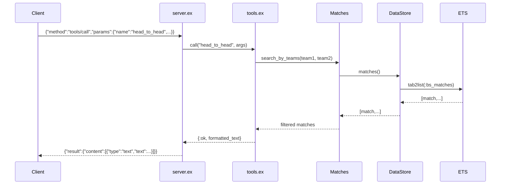

# Flow

A JSON-RPC line arrives on stdin and is decoded in `server.ex:loop/0`. `handle_request/1` matches `tools/call`, extracts the tool name + arguments, and dispatches through `tools.ex:call/2`. The tool handler calls the relevant `Queries.*` function, which reads the full match/player list from the ETS-backed `DataStore` and filters/aggregates in-memory with case-insensitive substring matching on normalized team names. The result is formatted into a human-readable text block, wrapped in an MCP `content` array, JSON-encoded, and written to stdout.

Notable: all queries do a full ETS table scan + linear filter (no indexing), which is acceptable at this dataset size; data is loaded once at GenServer init. Row parsers are defensively wrapped in `rescue → nil`, so malformed rows are silently dropped rather than crashing the load.
