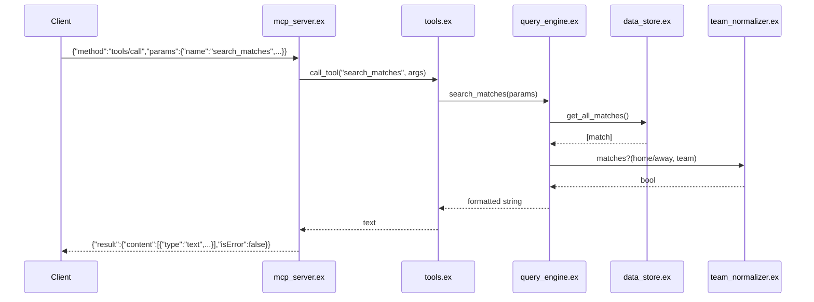

# Flow

A `tools/call` line arrives on stdin; `mcp_server.ex` decodes JSON-RPC, dispatches through `tools.ex` to the matching `query_engine.ex` function. The query engine pulls the pre-loaded dataset from the `DataStore` GenServer (CSVs parsed once at app start), filters via composable `filter_by_*` pipelines using `TeamNormalizer` for fuzzy team matching, formats a human-readable string, and the server wraps it in the MCP `content` envelope. Notable: all data is loaded eagerly into memory at startup (30s GenServer call timeouts); tool results are plain formatted strings rather than structured JSON payloads; CSV parse failures degrade to an empty list with a warning rather than crashing.
