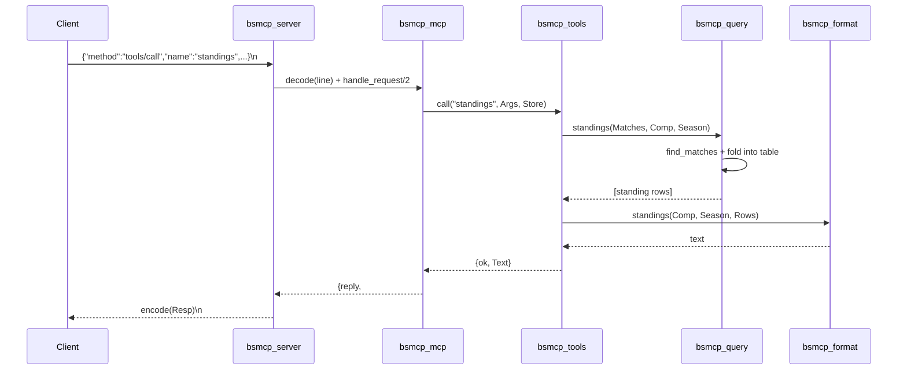

# Flow

At startup `bsmcp_server:main/1` loads every CSV into an in-memory store
(`load_store/1`), logging progress to **stderr**. The serve loop reads one
NDJSON line at a time from stdin, trims it, and `safe_decode`s it. A
notification (no `id`) produces no reply; a malformed line yields a
JSON-RPC parse error (-32700). For a `tools/call`, `bsmcp_mcp` dispatches
to `bsmcp_tools:call/3` inside a `try` (`safe_call`) so a tool crash is
returned as `isError:true` rather than killing the loop. The tool extracts
typed args, runs the pure query function in `bsmcp_query`, formats the
result via `bsmcp_format`, and the response is JSON-encoded back to stdout.

Notable design points: the protocol/transport/query/format layers are
cleanly separated and individually unit-tested; `bsmcp_query` functions are
pure (list in, list/map out), which is what makes the 105-test suite cheap.
Team names are matched on a precomputed normalized key (state-suffix
stripped, accents folded) while display names preserve accents; standings
group on the normalized key to avoid collapsing distinct clubs. No external
dependencies — uses OTP 27's built-in `json` module.
