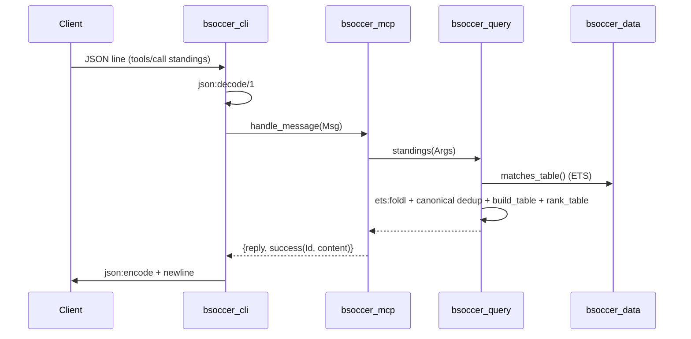

# Flow

A request arrives as one newline-delimited JSON object on stdin. `bsoccer_cli` decodes it and calls `bsoccer_mcp:handle_message/1`, which dispatches by method. For `tools/call`, it invokes the named `bsoccer_query` function, which folds over the protected `bsoccer_matches`/`bsoccer_players` ETS tables (populated once at startup by the `bsoccer_data` gen_server). The query layer returns `#{text, data}`; `bsoccer_mcp` wraps `text` as MCP `content` (and `data` as `structuredContent`), and `bsoccer_cli` JSON-encodes the reply back to stdout.

Notable design points:
- **Cross-source dedup:** the five overlapping match files are de-duplicated in `canonical/1` by bucketing on `{competition, season}` and keeping only rows from the single highest-priority source present in each bucket (`src_rank/1`).
- **Name normalisation:** two key flavours — fuzzy `*_key` (suffix-stripped, accent-folded) for matching loose user queries, and precise `*_ident` (suffix-preserving) so clubs differing only by state suffix (Atlético-MG/-GO/-PR) stay separate in tables.
- **No third-party deps:** JSON via OTP 27+ built-in `json` module; CSV, knowledge graph and transport all in plain Erlang.
- Tool argument errors surface as MCP `isError:true` results, not protocol-level errors, so an LLM can recover conversationally.
