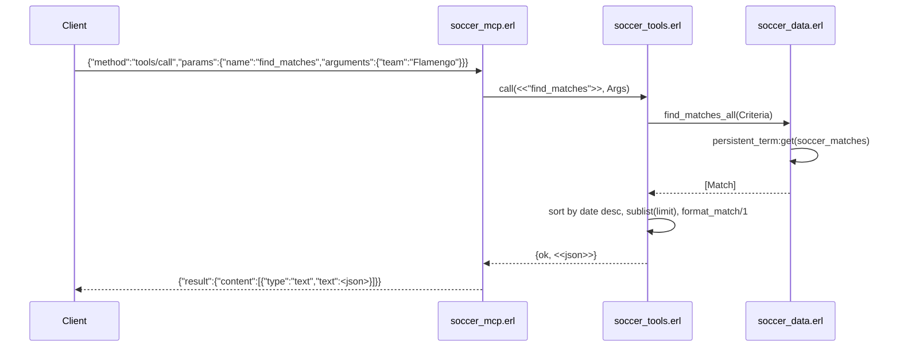

# Flow

A `tools/call` request is decoded by `soccer_mcp:handle_message/1`, dispatched to `soccer_tools:call/2`, which converts JSON args to an atom-keyed criteria map and queries the in-memory dataset via `soccer_data:find_matches_all/1`. Matches are loaded once at startup (`soccer_data:init/0`) into `persistent_term` for zero-copy reads; queries are linear `lists:filter` scans. Results are sorted, truncated to `limit` (default 20), JSON-encoded, and wrapped in an MCP `content` text block. Team matching normalizes the search term (strips state suffixes like `-RJ`) and does case-insensitive substring matching. Notable: no pagination cursors (offset-less `limit` only), all queries are full O(n) scans over the dataset, and individual CSV parse failures are swallowed (`catch _:_ -> []`) so a malformed file silently yields zero rows.
