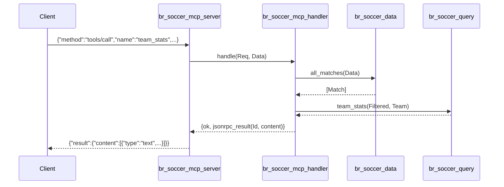

# Flow

On startup `br_soccer_data:load_all/1` parses all six CSVs once into memory; the
parsed `Data` map is threaded through every request (no per-call IO). A
`tools/call` line is JSON-decoded in `process_line/2`, dispatched by tool name in
`call_tool/3`, which unifies matches via `all_matches/1`, applies
competition → season → team filters, delegates the aggregate to a pure
`br_soccer_query` function, and renders a human-readable text block returned as
MCP `content`.

Notable: results are formatted as plain text rather than structured JSON content;
team matching is case-insensitive substring on state-suffix-normalized names;
parse errors in `process_line/2` are caught and returned as JSON-RPC -32700 rather
than crashing the loop. The OTP app/supervisor scaffolding exists but is unused by
the escript stdio path (empty child specs).
