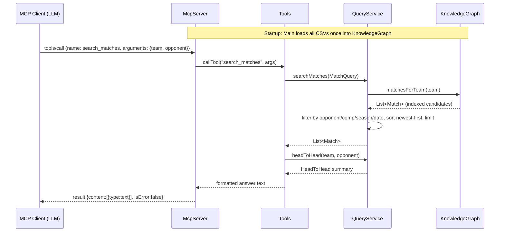

# Flow

A `tools/call` for `search_matches` is read as one JSON line on stdin and routed through `McpServer.handleMessage` to `Tools.callTool`, which builds a `MatchQuery` and calls `QueryService.searchMatches`. The query layer narrows to the smallest candidate set using the by-team index (falling back to all matches when no team is given), applies the remaining predicates, sorts chronologically newest-first, and truncates to `limit`. When both `team` and `opponent` are present, a head-to-head summary line is appended. `Tools` renders the records to plain text, and `McpServer` wraps it in the MCP `content` envelope written back as one JSON line on stdout.

Deviations / notes worth recording:
- All data is loaded into memory once at startup; queries are linear scans over indexed sublists, no external store or DB.
- Tool arguments are leniently coerced: unparseable seasons/dates/ints silently become null rather than erroring; only truly missing required args throw (`-32602`).
- Goal/result fields are nullable; analytics skip matches without results (`hasResult`).
- Team-name matching is fully delegated to `TeamNames.canonical` (accent-stripping, state-suffix handling, alias table); display names are preserved separately.
- No authentication, no pagination beyond `limit`, no concurrency (single-threaded read loop).
