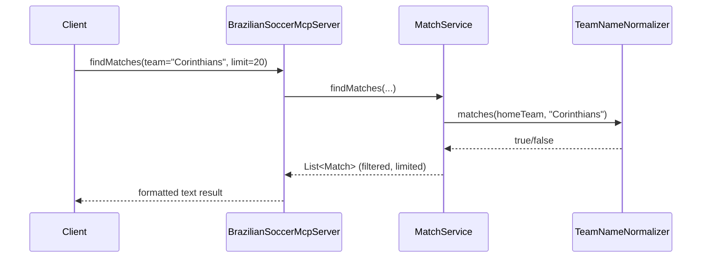

# Flow

At construction time the server eagerly loads every CSV via `DataLoader` into in-memory `Match`/`Player` lists, then constructs `MatchService` and `PlayerService`. A `findMatches` call streams the in-memory match list through a chain of predicate filters (team via the normalizer, home/away, competition aliasing, season, date range), applies a `limit`, and formats the survivors into a human-readable string. Normalization handles state suffixes ("Palmeiras-SP"), accents, and competition aliases ("copa", "brasileirao"). All queries are synchronous in-memory stream operations — no database, no pagination, no external API calls. Errors during CSV parsing are caught per-record and logged at FINE/WARNING level rather than failing the load.
