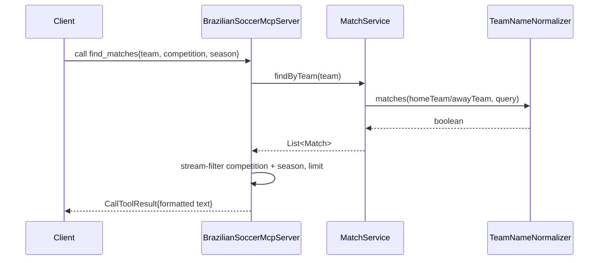

# Flow

On startup `main()` eagerly loads all match and player CSVs into memory, constructs the three services, and registers six tools on a `McpSyncServer` over stdio, then blocks on `Thread.join()`. A `find_matches` call resolves team matches through `TeamNameNormalizer` (suffix-stripping, case-insensitive contains), then applies competition/season filters and a result limit in the handler before formatting a text response.

Notable: all tool arguments are typed as `string` in the JSON schemas and parsed manually (numbers via `Integer.parseInt`, swallowing `NumberFormatException`). Goals/seasons that are blank or `NaN` parse to `0` rather than being treated as missing. Date filtering is by integer season only — no calendar date-range support despite multiple date formats in the data. The MCP tool-handler layer in `BrazilianSoccerMcpServer` has no direct unit tests; tests target the service/loader layer underneath it.
