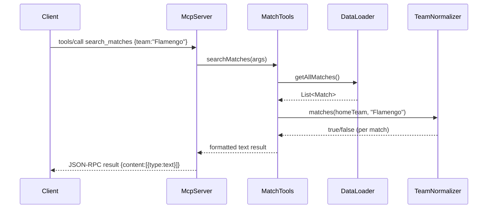

# Flow

On startup `McpServer.main()` constructs a `DataLoader`, calls `load()` to read all
six CSVs into memory once, then enters `run()` — a read-line loop over stdin parsing
JSON-RPC requests. A `tools/call` for `search_matches` dispatches (via a `switch` on
tool name) to `MatchTools.searchMatches`, which streams over the in-memory match list
applying team/competition/season/date filters (team matching delegated to
`TeamNormalizer`), sorts by date descending, limits results, and returns a
human-formatted text block wrapped in the MCP `content` envelope. Tool exceptions are
caught and returned as an error text payload rather than crashing the loop. All data is
held in unmodifiable in-memory lists; there is no database or external API call.
