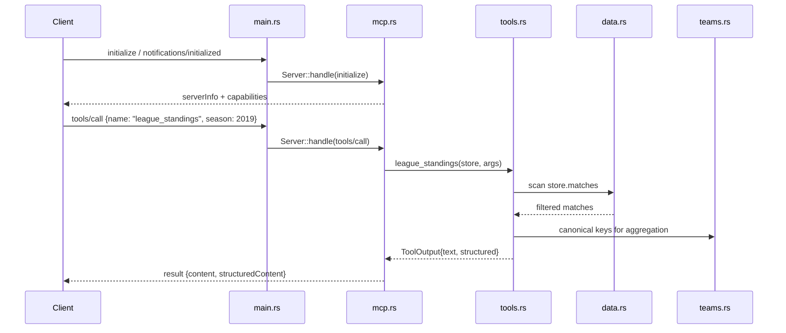

# Flow

At startup `main.rs` loads `data/kaggle/` once via `DataStore::load`, which
parses the five match files, unifies them into one `Match` shape, and
de-duplicates by `(competition, season, home_key, away_key)` so a fixture
appearing in several overlapping source files is counted once. The server then
loops over stdin, dispatching each JSON-RPC request through `Server::handle` to
the matching tool function, which scans the in-memory `Vec`s and returns both a
human-readable text rendering and a structured JSON payload.

Notable: in-memory linear scan per query (no indexes — fine for this corpus
size); team-name matching goes through a curated alias table that deliberately
keeps distinct same-named clubs (Atlético-MG vs Athletico-PR) apart; the dedup
key omits round/stage, which is correct for league round-robins but could merge
distinct cup pairings that repeat the same ordered fixture in a season.
