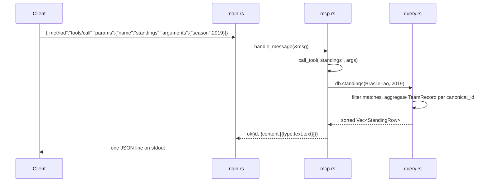

# Flow

At startup `main.rs` resolves the data dir (CLI arg → `BSMCP_DATA_DIR` → `./data/kaggle` → crate dir), calls `Database::load` once to read and de-duplicate all CSVs into memory, then loops over stdin. Each line is parsed as JSON-RPC; `McpServer::handle_message` returns `Some(response)` for requests and `None` for notifications. `tools/call` dispatches by name to a `tool_*` method that builds a `MatchFilter`, calls the pure query method, and formats human-readable text. Diagnostics go to stderr so the stdout JSON-RPC stream stays clean. Errors are surfaced in-band via `isError: true` rather than JSON-RPC errors. Notable: data is fully in-memory and immutable after load; team-name matching uses a loose key for queries and a strict `canonical_id` (state-code retained) for standings/dedup to keep same-named clubs apart.
