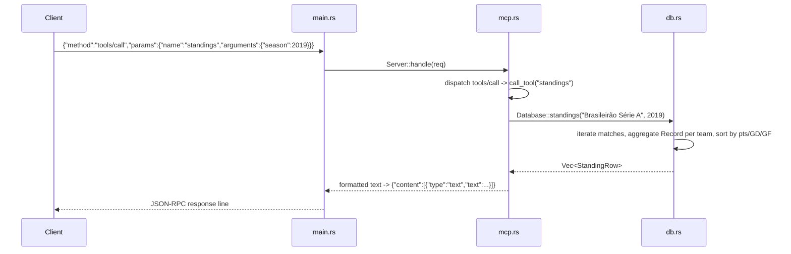

# Flow

At startup `main.rs` calls `Database::load_from_dir`, which parses all six CSVs via `loader::load_all`, de-duplicates fixtures that appear in multiple files (`Database::dedup_matches`), and builds a normalized-key → display-name index. The server then reads one JSON-RPC request per stdin line; `mcp::Server::handle` dispatches `tools/call` to `call_tool`, which invokes the typed query on `Database` and formats the result as MCP text content written back to stdout. Diagnostics go to stderr so they never corrupt the JSON-RPC stream.

Notable: in-memory full-scan queries (no indexes beyond the team-name map) — adequate for ~15k matches / ~18k players; team input is fuzzy-resolved via exact-key then substring match; the BR-Football dataset is deliberately restricted to Série B/C to avoid double-counting Série A/Copa already loaded authoritatively elsewhere.
