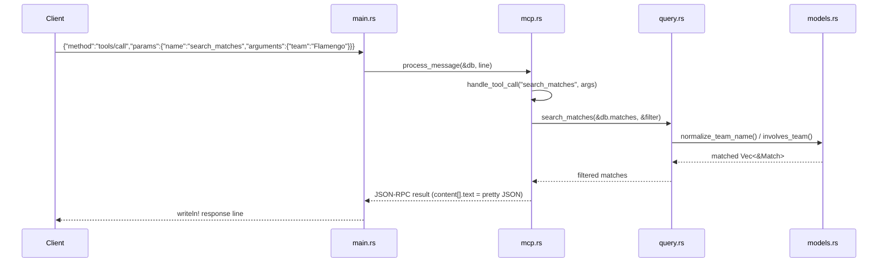

# Flow

At startup `main.rs` loads all six CSVs once via `Database::load_from_dir` (data dir resolved relative to cwd or the executable). It then reads JSON-RPC requests line-by-line from stdin; each is dispatched in `mcp.rs:process_message`. A `tools/call` routes through `handle_tool_call` to the matching `query::*` function, which filters/aggregates the in-memory `Vec<Match>`/`Vec<Player>` using `normalize_team_name` for fuzzy team matching. The result is serialized as pretty JSON inside an MCP `content` text block and written back as one response line.

Deviations from common patterns: data is held fully in memory (no DB/index), so all queries are linear scans; team matching uses substring `contains` after normalization (can over-match on short names); date-range filtering is lexicographic string comparison, which is only correct for ISO-formatted dates. The `tokio` async runtime is pulled in but I/O is actually synchronous (`std::io` stdin loop).
