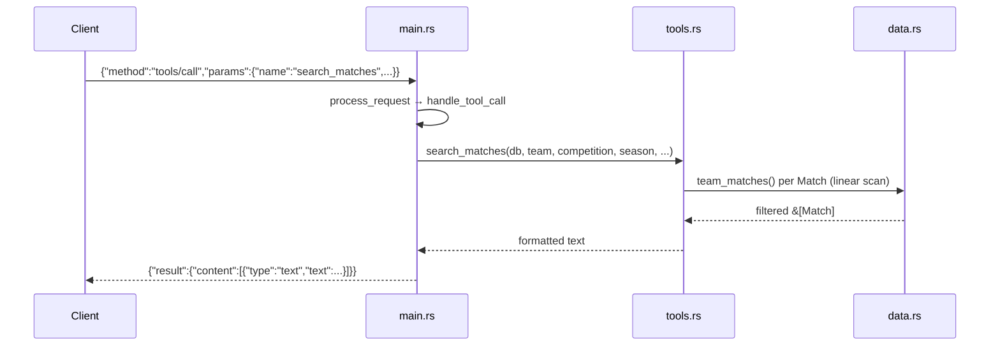

# Flow

On startup `main()` discovers `data/kaggle/` (relative-path candidates or `SOCCER_DATA_DIR`), loads all six CSVs into an in-memory `Database`, then reads newline-delimited JSON-RPC requests from stdin and writes responses to stdout. A `tools/call` is dispatched by tool name in `handle_tool_call`; each query does a linear scan over the in-memory vectors and returns a human-readable text block.

Deviations from common patterns: the MCP layer is hand-rolled (no official MCP SDK crate) but conforms to the JSON-RPC/MCP shape. Queries are O(n) full scans with no indexing. Date-range filtering uses raw string comparison, which is only correct for the ISO-formatted datasets, not the DD/MM/YYYY historical file. Team aggregations span all six datasets without competition filtering by default, so the overlapping 2012–2019 Brasileirão data can be counted twice.
