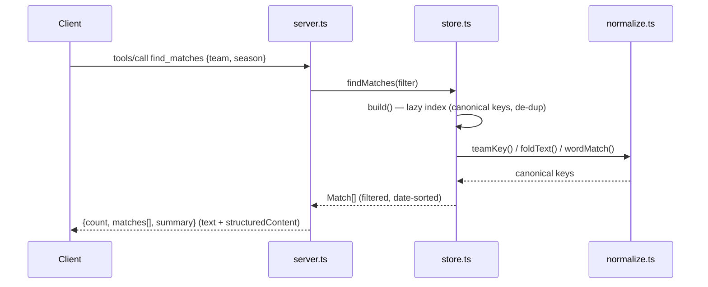

# Flow

A client calls an MCP tool such as `find_matches`. `server.ts` forwards the validated (zod) arguments to `DataStore`, which lazily builds a cached index over the raw matches: a two-pass build that (1) detects base team names occurring with multiple states to decide when a state suffix is part of a team's identity, and (2) assigns canonical keys/display names and de-duplicates the same fixture recorded across multiple CSV files. The query filters the indexed matches via accent/suffix-insensitive key matching, sorts by date descending, and the tool wraps the result as both human-readable text and `structuredContent`.

Notable: all data is held in memory and queried with linear scans (no secondary indexes by team/season), which is adequate for the bundled dataset sizes (~24k matches, ~18k players). The index is invalidated and fully rebuilt whenever a match is added, so seeding all matches then querying is O(n) per build — fine for batch load, but `addMatch` in a loop after queries would rebuild repeatedly. Team de-duplication and state disambiguation are heuristic and documented as approximate for same-base-name clubs.
