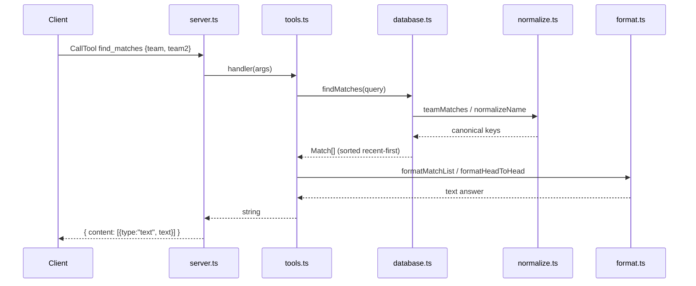

# Flow

At startup `index.ts:main` calls `loadAll(dataDir)` to parse all six CSVs, then constructs `SoccerDatabase`, which canonicalizes overlapping (competition, season) groups to a single non-duplicated source (`loader.ts:canonicalMatches`). A `find_matches` tool call flows from the MCP stdio transport into the matching `ToolDef.handler`, which queries `SoccerDatabase` (filtering through the accent-/suffix-tolerant normalization layer, sorted most-recent first), then renders the result with the `format.ts` helpers and returns it as MCP text content. Handler errors are caught in `server.ts` and returned as `isError` text rather than thrown. The server is transport-agnostic: `buildServer` is separated from `runStdio` so it can be driven by an in-memory client in tests.
