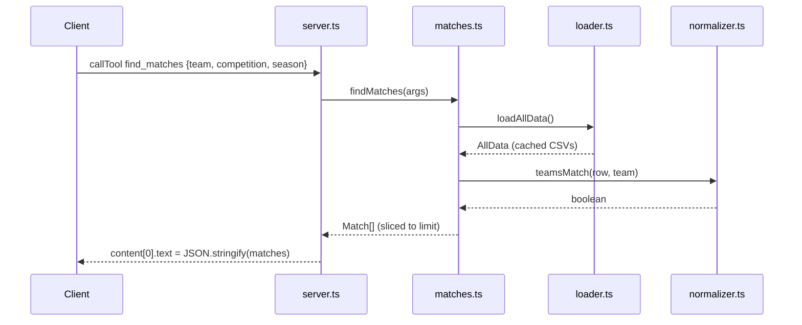

# Flow

A `find_matches` call enters `server.ts`'s `CallToolRequestSchema` handler, which dispatches via a `switch` to `findMatches`. That loads (and memoizes) all seven CSVs through `loadAllData()`, then filters each competition dataset by `teamsMatch` (state-suffix-stripping substring match) and exact `season`, normalizes the heterogeneous `historico`/`br_football` schemas into a common `{home_team, away_team, ...}` shape, concatenates, and slices to `limit`. The result is JSON-stringified into a single text content block. The same load → filter → aggregate → stringify pattern backs all five tools.

Notable: all data is loaded eagerly on first tool call and cached for the process lifetime; filtering is linear scans (no indexing); errors are caught per-call and returned as `{error}` text with `isError: true` rather than thrown.
