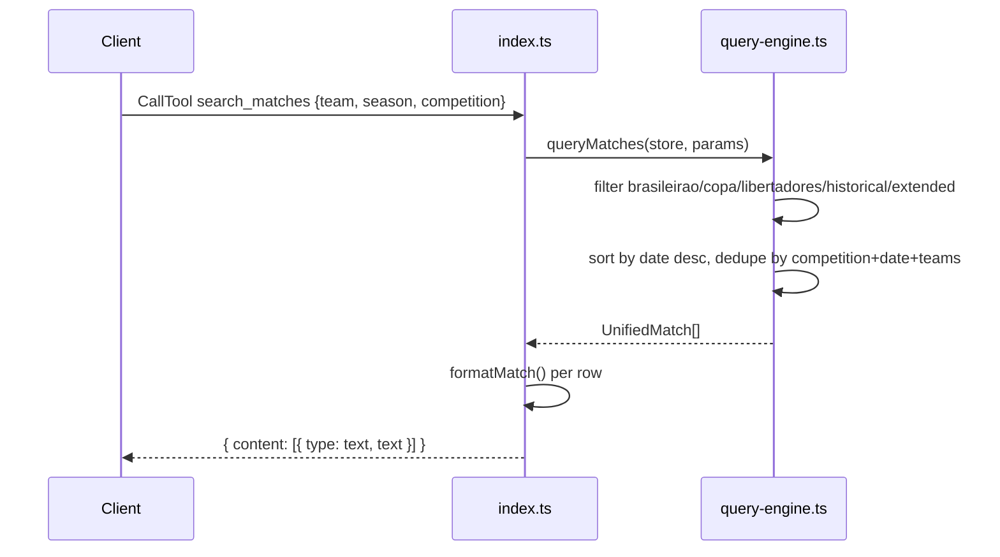

# Flow

On startup `loadAllData()` parses all six CSVs once into a cached `DataStore`. Each tool call dispatches through the `CallTool` switch in `index.ts`, delegates to a pure function in `query-engine.ts`, and formats the result as MCP text content. Errors are caught and returned as `isError: true` text rather than throwing.

Notable deviations: aggregation paths that union overlapping source files (`getStandings`, and `queryMatches` with no competition filter feeding `getTeamStats`/`getLeagueStats`/`getBiggestWins`) **do not dedupe across source datasets** — only an exact `competition|date|home|away` key is deduped, and differing competition labels for the same physical match defeat it. Team matching uses bidirectional substring (`a.includes(b) || b.includes(a)`), which is loose. No input validation on tool args beyond TypeScript casts.
