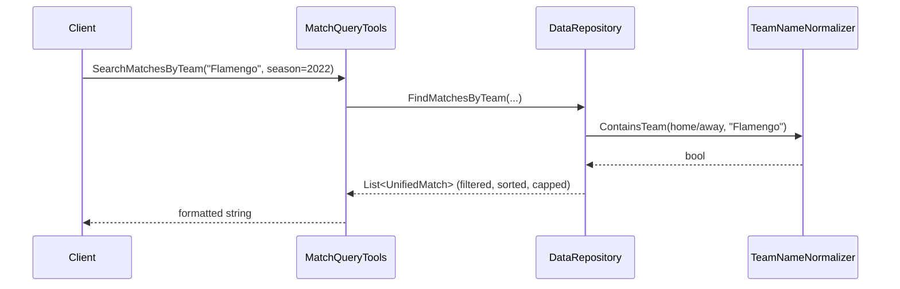

# Flow

At startup `Program.cs` resolves the `data/kaggle` directory (env `SOCCER_DATA_PATH` or a walk up from the binary), constructs a singleton `DataRepository`, and calls `LoadAll()` — which parses all six CSVs eagerly and de-duplicates the Brasileirão vs. historical overlap by season. Each query tool then filters the pre-loaded in-memory lists via LINQ: team matching goes through `TeamNameNormalizer` (diacritic/state-suffix–insensitive `Contains`), while standings deliberately use *exact* name matching to keep `Atlético-MG` distinct from `Atlético-PR`. Points/records are computed on the fly; nothing is hardcoded.

Notable: competition and season filters use exact `Equals(..., OrdinalIgnoreCase)` on the diacritic form (e.g. `"Brasileirão"`), so a caller passing `"Brasileirao"` gets no results. All tools return formatted strings rather than structured JSON payloads. Loading is synchronous and fully in-memory.
